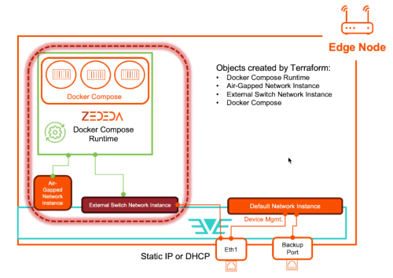
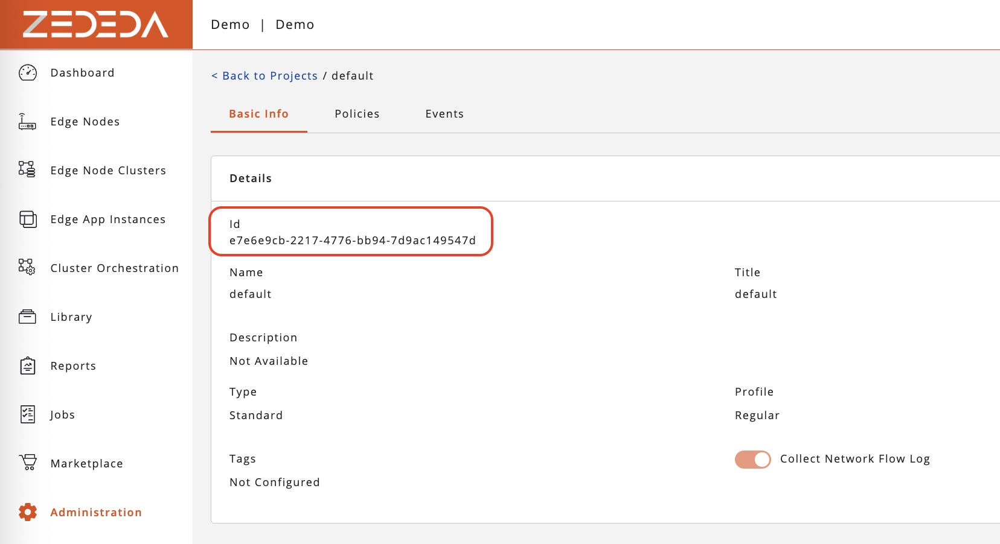
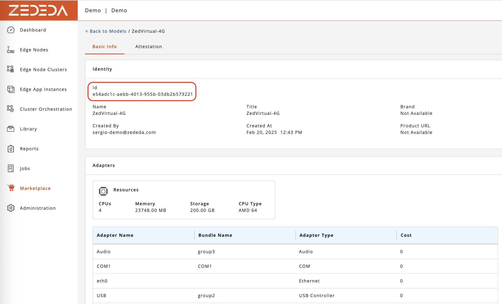

### ZEDEDA Docker Compose Runtime and Application Deployment

This repository automates the deployment of ZEDEDA's docker compose runtime and a corresponding docker compose application.



It uses the ZEDEDA's terraform provider whose version is defined under the [versions.tf](./versions.tf) file.

User must provide provide the ZEDEDA cloud API url and the corresponding access token in the [provider.tf](./provider.tf) file:

```
provider "zedcloud" {
    zedcloud_url = "https://zedcontrol.gmwtus.zededa.net" #### Pick the cluster where you will be executing these commands against.
  # Configuration options
    zedcloud_token = "###INSERT ZEDEDA API TOKEN"

}
```

## Input variables

All the necessary input variables are provided as part of the [variables.tf](./variables.tf) files.

This terraform plan assumes that a device is already onboarded with at least EVE 14.5.0-LTS or later.

## Project_ID ## 

Corresponds to the Project ID where the device is onboarded. Can be obtained from the UI by selecting:

Administration - Projects


## Project_name ##

Name of the project

## Model_ID ## 

Device model ID. 
Can be obtained from the UI by selecting:

Marketplace - Models 



## Docker_runtime_App_Template ## 

The name of the docker runtime in the marketplace.

It's required the clone one of the existing ZEDEDA available runtimes and remove the cloud-init/user Config by setting the option:

"Allow Edge App deployments to set entire configuration"

The full cloud-init script will be provided as part of this automation workflow and is available [here](./ci-scripts/docker-rt-ci.txt)


## docker_rutime_app_instance_list ##

This variable is a list of objects. It represents the list of runtime instances that must be deployed across a fleet of devices.

Each entry in the list must provide:

### runtime_template_name ###

The name of the ZEDEDA Docker Runtime available in the Marketplace 

### device_name ###
    
The name of the device 

### switch_device_interface ###

The device interface that should be connected to a switch network instance supporting the docker runtime VM external communication.


## docker_compose_app_instance_list ##

The list of docker-compose application instances to be deployed.
Each entry of the list requires:

### name ###
Docker Compose Application instance name

### app_image_name ###
Docker Compose Application name in Marketplace

### category ###
Marketplace application category


### device_name ###
Name of the edge device where the docker compose application instance must be deployed

### artifacts ###
Path within the HTTP datastore for the tarball containing the docker compose artifacts. 
In this example we have the following docker compose tarball available [here](./docker-compose-artifacts/nginx-nodejs-redis-docker-compose.tar.gz)


### datastore ###
Reference to the datastore where the docker compose tarball is stored.

```
❯ tar -tvzf ./docker-compose-artifacts/nginx-nodejs-redis-docker-compose.tar.gz
drwxrwxr-x  0 pocuser pocuser      0 Aug  3 12:56 ./
-rw-rw-r--  0 pocuser pocuser   3484 Aug  3 12:56 ./README.md
drwxrwxr-x  0 pocuser pocuser      0 Aug  3 12:56 ./web/
-rw-rw-r--  0 pocuser pocuser     13 Aug  3 12:56 ./web/.gitignore
-rw-rw-r--  0 pocuser pocuser    143 Aug  3 12:56 ./web/Dockerfile
-rw-rw-r--  0 pocuser pocuser    284 Aug  3 12:56 ./web/package.json
-rw-rw-r--  0 pocuser pocuser    687 Aug  3 12:56 ./web/server.js
-rw-rw-r--  0 pocuser pocuser  15756 Aug  3 12:56 ./web/package-lock.json
drwxrwxr-x  0 pocuser pocuser      0 Aug  3 12:56 ./nginx/
-rw-rw-r--  0 pocuser pocuser    171 Aug  3 12:56 ./nginx/nginx.conf
-rw-rw-r--  0 pocuser pocuser    103 Aug  3 12:56 ./nginx/Dockerfile
-rw-rw-r--  0 pocuser pocuser    370 Aug  3 12:56 ./compose.yaml
```


